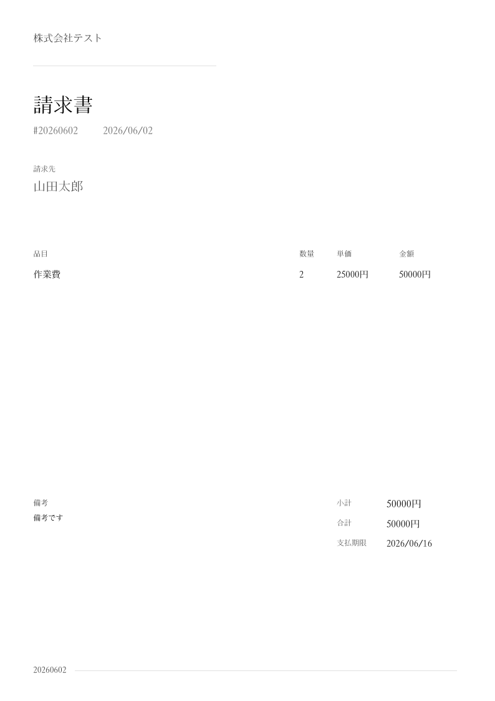

# Invoice

Generate invoices from the command line.

## Japanese Support

This fork embeds a Japanese TrueType font so generated invoices can display
Japanese text. For JPY invoices, amounts are formatted without fractional digits
and use the `円` suffix. Invoice labels are localized for Japanese output, and
default dates use the `yyyy/MM/dd` format.

## Command Line Interface

```bash
invoice generate --from "株式会社テスト" --to "山田太郎" \
    --item "作業費" --quantity 2 --rate 25000 \
    --currency JPY --note "備考です" \
    --date "2026/06/30" --due "2026/7/31"
```


View the generated PDF at `invoice.pdf`, you can customize the output location
with `--output`.

```bash
open invoice.pdf
```



### Environment

Save repeated information with environment variables:

```bash
export INVOICE_LOGO=/path/to/image.png
export INVOICE_FROM="株式会社テスト"
export INVOICE_TO="山田太郎"
export INVOICE_RATE=25000
export INVOICE_CURRENCY=JPY
```

Generate new invoice:

```bash
invoice generate \
    --item "作業費" \
    --detail "管理画面の改修\nPDF出力対応" \
    --quantity 2 \
    --note "備考です" \
    --output japanese-invoice.pdf
```

Use one `--detail` for each `--item`, in the same order. Both actual newlines
and escaped `\n` sequences are rendered as additional lines below the item
name. Details are optional, so items without a matching detail are still
generated normally.

### Estimate

Generate an estimate without creating accounting data:

```bash
invoice estimate \
    --from "株式会社テスト" --to "山田太郎" \
    --item "作業費" --quantity 1 --rate 50000 \
    --currency JPY --due "2026/07/11" \
    --output estimate.pdf
```

The estimate command uses `見積書`, `見積先`, and `見積有効期限` by default.
It accepts the same flags and JSON/YAML import format as `generate`.

Japanese text is rendered with GenEi Koburi Mincho. The bundled font is
licensed under the SIL Open Font License 1.1; see `fonts/OFL.txt`.

### Configuration File

Or, save repeated information with JSON / YAML:

```json
{
    "logo": "/path/to/image.png",
    "from": "株式会社テスト",
    "to": "山田太郎",
    "currency": "JPY",
    "items": ["作業費"],
    "details": ["管理画面の改修\nPDF出力対応"],
    "quantities": [2],
    "rates": [25000],
    "note": "備考です"
}
```

Generate new invoice by importing the configuration file:

```bash
invoice generate --import path/to/data.json \
    --output japanese-invoice.pdf
```

### Custom Templates

If you would like a custom invoice template for your business or company, please
reach out via:

* [Email](mailto:maas@lalani.dev)
* [Twitter](https://twitter.com/maaslalani)

## Installation

<!--

Use a package manager:

```bash
# macOS
brew install invoice

# Arch
yay -S invoice

# Nix
nix-env -iA nixpkgs.invoice
```

-->

Install with Go:

```sh
go install github.com/maaslalani/invoice@main
```

Or download a binary from the [releases](https://github.com/maaslalani/invoice/releases).

## License

[MIT](https://github.com/maaslalani/invoice/blob/master/LICENSE)

## Feedback

I'd love to hear your feedback on improving `invoice`.

Feel free to reach out via:
* [Email](mailto:maas@lalani.dev)
* [Twitter](https://twitter.com/maaslalani)
* [GitHub issues](https://github.com/maaslalani/invoice/issues/new)

---

<sub><sub>z</sub></sub><sub>z</sub>z
